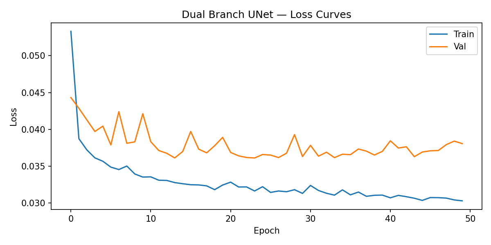

# Dual Branch UNet — Documentation

> CNN1 of the Precipitation Downsampling project (ADLEO Course).  
> Owner: Bikal

---

## Table of Contents

- [Overview](#overview)
- [Data Sources](#data-sources)
- [Data Pipeline](#data-pipeline)
- [Model Architecture](#model-architecture)
- [Loss Function](#loss-function)
- [Training Configuration](#training-configuration)
- [Experiment Results](#experiment-results)
- [How to Run](#how-to-run)

---

## Overview

**Goal:** Downscale IMERG satellite precipitation from ~10 km to 250 m resolution over the Big Island of Hawai'i.

**Approach:** A Dual Branch UNet fuses two input modalities — coarse satellite precipitation + cloud cover (Branch 1) and high-resolution topographic data (Branch 2) — at a shared bottleneck, then decodes to a 32×32 high-resolution precipitation field. Training is supervised by sparse ground-truth rain gauge measurements via a station mask.

**Region:** Big Island of Hawai'i  
**Bounding box:** lon [−156.07, −154.799], lat [18.89, 20.277]  
**Temporal coverage:** 2020 (train), Jan–Jun 2021 (val + test)

---

## Data Sources

| Source | Variable | Resolution | Description |
|---|---|---|---|
| NASA IMERG Early Run V07B | Precipitation (mm/day) | 0.1° (~10 km) | Daily satellite precipitation estimates |
| GOES-17 | BCM (Binary Cloud Mask) | ~2 km | Daily cloud cover indicator |
| HCDP Station CSVs | Daily rainfall (mm) | Point (~165 stations) | Ground-truth rain gauge observations |
| SRTM/DEM (`geostack_30m_topo.tif`) | Elevation, Slope, Aspect | 30 m | Topographic stack for Big Island |

---

## Data Pipeline

```
IMERG (.tif)  ──┐
GOES-17 (.nc) ──┼──► process_data.py ──► 5-band input TIF (processed_precip_YYYYMMDD.tif)
DEM (.tif)    ──┘

HCDP stations ──────────────────────────► rasterized_stations/XYYYY.MM.DD.tif

                    create_csv.py
                         ▼
              data/processed/file_paths.csv
                         ▼
                    LoadDataset
                         ▼
              32×32 chips  (input, target, station_mask)
```

### Input Raster Bands (5 channels)

| Band | Source | Branch | Description |
|---|---|---|---|
| 1 | IMERG | Branch 1 | Daily precipitation (mm/day) |
| 2 | GOES-17 | Branch 1 | Binary cloud mask |
| 3 | DEM | Branch 2 | Elevation (m) |
| 4 | DEM | Branch 2 | Slope (degrees) |
| 5 | DEM | Branch 2 | Aspect (degrees) |

### Preprocessing Steps
1. Clip all data to Big Island bounding box
2. Reproject and align all sources to HCDP resolution grid
3. Extract 32×32 chips centered on valid station pixels
4. Min-Max normalize input band 1 and target per chip to [0, 1]
5. Optional augmentation: random 90° rotations + horizontal/vertical flips (training only)

### Station Mask
Each chip carries a boolean `station_mask` tensor (shape `1×32×32`) — `True` at pixels where a rain gauge measurement exists. Used to compute loss only where ground truth is known.

---

## Model Architecture

### Design Decisions

| Decision | Choice | Reason |
|---|---|---|
| Branch split | Branch 1: precip+GOES (bands 0–1), Branch 2: topo (bands 2–4) | Groups satellite observations vs. static terrain |
| Fusion point | Bottleneck only | Clean separation of modalities; simpler decoder |
| Skip connections | None | Bottleneck-only fusion per design |
| Depth | 3 downsampling steps | 32×32 chips → 4×4 bottleneck (maximum depth before collapse) |

### Architecture Diagram

```
Input (B, 5, 32, 32)
        │
        ├─────────────────────────────────────────────┐
        │  Branch 1 (precip + GOES)                   │  Branch 2 (topo)
        │  in_ch = 2                                  │  in_ch = 3
        │                                             │
        │  ConvBlock(2 → 32)    (B, 32, 32, 32)       │  ConvBlock(3 → 32)    (B, 32, 32, 32)
        │  MaxPool2d(2)         (B, 32, 16, 16)       │  MaxPool2d(2)         (B, 32, 16, 16)
        │  ConvBlock(32 → 64)   (B, 64, 16, 16)       │  ConvBlock(32 → 64)   (B, 64, 16, 16)
        │  MaxPool2d(2)         (B, 64,  8,  8)       │  MaxPool2d(2)         (B, 64,  8,  8)
        │  ConvBlock(64 → 128)  (B, 128,  8,  8)      │  ConvBlock(64 → 128)  (B, 128,  8,  8)
        │  MaxPool2d(2)         (B, 128,  4,  4)      │  MaxPool2d(2)         (B, 128,  4,  4)
        └──────────────── torch.cat(dim=1) ───────────┘
                           (B, 256, 4, 4)
                        ConvBlock(256 → 256)
                                │
                       ── Shared Decoder ──
                   ConvTranspose2d(256 → 128)  →  (B, 128, 8, 8)
                       ConvBlock(128 → 128)
                   ConvTranspose2d(128 → 64)   →  (B, 64, 16, 16)
                       ConvBlock(64 → 64)
                   ConvTranspose2d(64 → 32)    →  (B, 32, 32, 32)
                       ConvBlock(32 → 32)
                       Conv2d(32 → 1, 1×1)
                                │
                       Output (B, 1, 32, 32)
```

### Conv Block
```
Conv2d(in_ch, out_ch, kernel=3, padding=1, bias=False)
BatchNorm2d(out_ch)
ReLU(inplace=True)
Conv2d(out_ch, out_ch, kernel=3, padding=1, bias=False)
BatchNorm2d(out_ch)
ReLU(inplace=True)
```

### Parameter Count

**Total trainable parameters: 2,315,553**

---

## Loss Function

```
Total Loss = λ₁ · MaskedMSE + λ₂ · TVLoss
```

### Masked MSE
Computed only at pixels where `station_mask = True`:
```
MaskedMSE = mean((pred[mask] − target[mask])²)
```
Focuses learning on locations with real ground-truth measurements.

### Total Variation Loss
Computed over the full predicted output:
```
TVLoss = mean(|pred[:,1:,:] − pred[:,:-1,:]|   ← row differences
            + |pred[:,:,1:] − pred[:,:,:-1]|)  ← column differences
```
Penalises abrupt pixel-to-pixel changes, encouraging smooth spatial rainfall fields.

### Weights

| Parameter | Default | Description |
|---|---|---|
| `--lambda-mse` (λ₁) | 1.0 | Station prediction accuracy |
| `--lambda-tv` (λ₂) | 0.1 | Spatial smoothness regularisation |

---

## Training Configuration

| Parameter | Value |
|---|---|
| Device | MPS (Apple Silicon M2 Max GPU) |
| Chip size | 32 × 32 pixels |
| Batch size | 64 |
| DataLoader workers | 8 (persistent) |
| Optimizer | Adam |
| Learning rate | 1e-3 |
| Epochs | 50 |
| Checkpoint strategy | Save on best val loss (not last epoch) |

### Data Split

| Split | Period | Days | Chips | Ratio |
|---|---|---|---|---|
| Train | Jan–Dec 2020 | 366 | 13,039 | ~60% |
| Val | Jan–Mar 2021 | 90 | 3,138 | ~15% |
| Test | Apr–Jun 2021 | 91 | 3,242 | ~15% |
| Unused | Jul–Dec 2021 | 184 | — | — |

> Sequential time-based splits are used — dates are never shuffled across splits to prevent future data leakage into training.

---

## Experiment Results

### Run 1 — 2026-05-04

| Metric | Value |
|---|---|
| Best val loss | **0.0361** |
| Best epoch | **24 / 50** |
| Final train loss | 0.0303 (mse=0.0299, tv=0.0043) |
| Final val loss | 0.0381 (mse=0.0375, tv=0.0054) |
| Test loss | **0.0332** |

### Loss Breakdown at Best Epoch (Epoch 24)

| Split | Total Loss | MSE | TV |
|---|---|---|---|
| Train | 0.0316 | 0.0311 | 0.0053 |
| Val | 0.0361 | 0.0354 | 0.0069 |

### Epoch-by-Epoch Summary (selected)

| Epoch | Train | Train MSE | Val | Val MSE | Note |
|---|---|---|---|---|---|
| 1 | 0.0533 | 0.0486 | 0.0443 | 0.0439 | ✓ best |
| 6 | 0.0349 | 0.0342 | 0.0379 | 0.0374 | ✓ best |
| 14 | 0.0328 | 0.0321 | 0.0361 | 0.0355 | ✓ best |
| 24 | 0.0316 | 0.0311 | 0.0361 | 0.0354 | ✓ best (saved) |
| 50 | 0.0303 | 0.0299 | 0.0381 | 0.0375 | last epoch |

### Key Observations

- **TV loss** dropped sharply in early epochs (0.047 → ~0.005) — model learned smooth outputs quickly
- **MSE dominates** throughout — model is optimising real station prediction, not just smoothness
- **Best checkpoint at epoch 24** — val loss improved consistently through epoch 14, then small gains to epoch 24
- **Mild overfitting after epoch 24** — train MSE continued falling (0.0311 → 0.0299) while val MSE plateaued at ~0.036–0.038
- **Train/Val gap ~0.006 MSE** — overfitting is mild, not severe
- **Test loss (0.0332) < Val loss (0.0361)** — model generalises well to the Apr–Jun 2021 test period

### Loss Curve



---

## How to Run

### 1. Prepare data
```bash
python src/training/process_data.py   # process IMERG + GOES + DEM → 5-band TIFs
python src/training/create_csv.py     # build file catalog
```

### 2. Train
```bash
# default settings
python train.py

# custom settings
python train.py \
  --train-start 20200101 --train-end 20201231 \
  --val-start   20210101 --val-end   20210331 \
  --test-start  20210401 --test-end  20210630 \
  --epochs 50 --batch-size 64 --lr 1e-3 \
  --lambda-mse 1.0 --lambda-tv 0.1
```

### 3. Outputs

| Output | Path |
|---|---|
| Best model checkpoint | `models/dual_branch_unet.pth` |
| Loss curve plot | `docs/loss_curve.png` |

### CLI Reference

| Flag | Default | Description |
|---|---|---|
| `--train-start/end` | 20200101/20201231 | Training date range |
| `--val-start/end` | 20210101/20210331 | Validation date range |
| `--test-start/end` | 20210401/20210630 | Test date range |
| `--epochs` | 50 | Number of training epochs |
| `--batch-size` | 64 | Batch size |
| `--lr` | 1e-3 | Learning rate |
| `--num-workers` | 8 | DataLoader worker processes |
| `--lambda-mse` | 1.0 | Masked MSE loss weight |
| `--lambda-tv` | 0.1 | Total variation loss weight |
| `--no-plot` | off | Disable loss curve saving |
